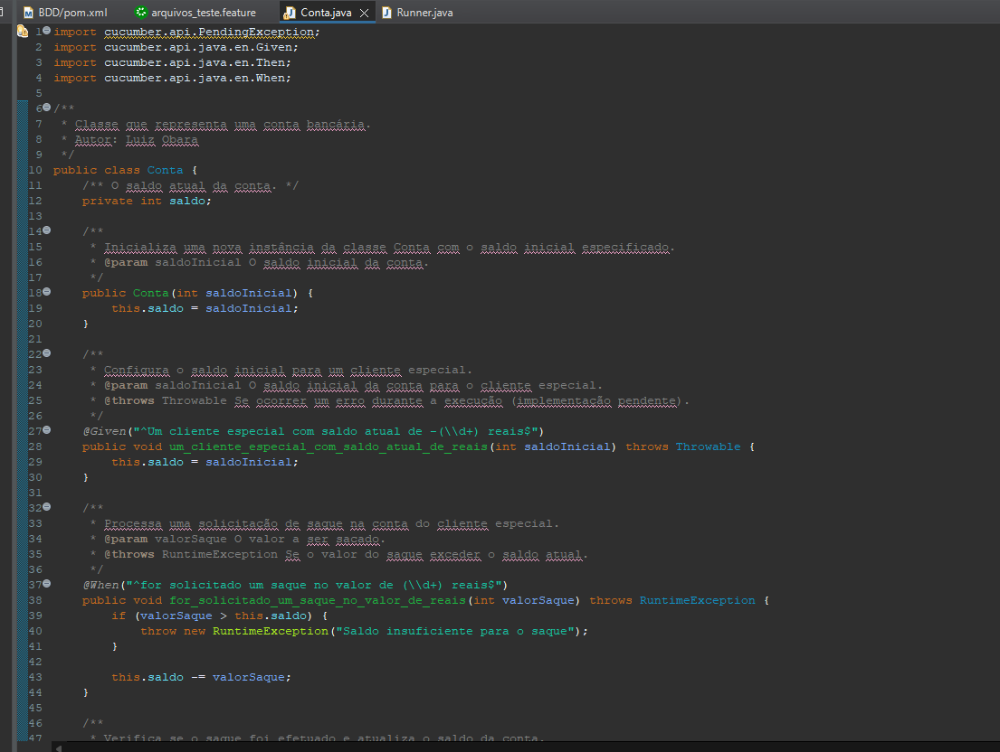

# BDD - Conta
## Avaliação Final de Qualidade e Testes de Software

- PARA ESTÁ ATIVIDADE CONFIRA O CONTEÚDO DISPONÍVEL DA [AULA 11](aula/tqs_BDD_RUNNER_0711.pdf);
- REPRODUZA O EXEMPLO DADO CONFORME EXPLICADO EM AULA;
- CRIE UM REPOSITÓRIO REMOTO DO PROJETO, ESCREVA O README.MD CONFORME O EXEMPLO DADO NO CONTEÚDO DA AULA;
- ESCREVA O CÓDIGO DA CLASSE CONTA UTILIZANDO OS MÉTODOS QUE O CUCUMBER INDICOU;
- AO TÉRMINO, EXECUTE O PROJETO E VERIFIQUE AS INFORMAÇÕES DADAS NO CONSOLE, TIRE PRINT DESTAS INFORMAÇÕES E UTILIZE NA CONSTRUÇÃO DO README.MD DO REPOSITÓRIO REMOTO DO PROJETO;
- APÓS TER TODAS AS ETAPAS CRIADAS, CRIE A DOCUMENTAÇÃO DA CLASSE CONTA E DO ARQUIVO DE TESTE CUCUMBER (USE O EXEMPLO QUE A BIBLIOTECA GERA NO ARQUIVO), GERE UM JAVA DOC DO PROJETO;

## Finalizando o exemplo da aula
Aqui finalizo o passo final dos slides da aula 11 com a classe runner sendo implementada no projeto.

## Escrevendo o código da classe conta
Classe [`Conta`](src/main/java/Conta.java/)

## Executando o projeto
Informações dadas no console.

## Gerando o JavaDoc do projeto e a documentação da classe conta
Documentação da classe [`Conta`](src/main/java/Conta.java/), JavaDoc está no caminho [`doc/`](doc/)

# Última atualização - 29/11/2023
